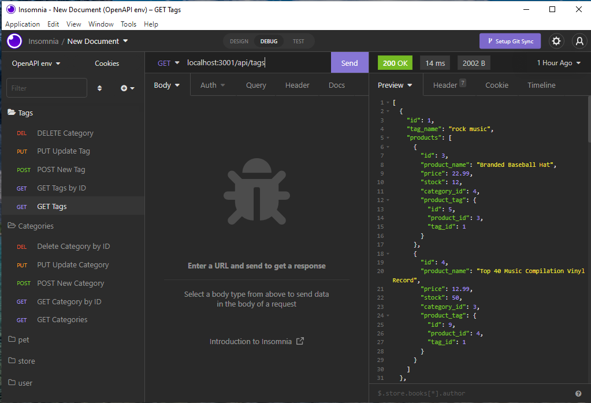

# E-commerce-Back-End

## Description

E-commerce site that take a working express.js API and configure it to use Sequelize to interact with mysql database.

## Screenshot

- All categories


- All Tags



- All Production


## User story

```text
AS A manager at an internet retail company
I WANT a back end for my e-commerce website that uses the latest technologies
SO THAT my company can compete with other e-commerce companies
```

### Acceptance Criteria

```text
GIVEN a functional Express.js API
WHEN I add my database name, MySQL username, and MySQL password to an environment variable file
THEN I am able to connect to a database using Sequelize
WHEN I enter schema and seed commands
THEN a development database is created and is seeded with test data
WHEN I enter the command to invoke the application
THEN my server is started and the Sequelize models are synced to the MySQL database
WHEN I open API GET routes in Insomnia for categories, products, or tags
THEN the data for each of these routes is displayed in a formatted JSON
WHEN I test API POST, PUT, and DELETE routes in Insomnia
THEN I am able to successfully create, update, and delete data in my database
```
## Database Models

- `Category`

    - `id`
        - Integer
        - Doesn't allow null values
        - Set as primary key
        - Uses auto increment

    - `category_name`
        - String
        - Doesn't allow null values

- `Product`

    - `id`
        - Integer
        - Doesn't allow null values
        - Set as primary key
        - Uses auto increment

    - `product_name`
        - String
        - Doesn't allow null values

    - `price`
        - Decimal
        - Doesn't allow null values
        - Validates that the value is a decimal

    - `stock`
        - Integer
        - Doesn't allow null values
        - Set a default value of 10
        - Validates that the value is numeric

    - `category_id`
        - Integer
        - References the category model's id

- `Tag`

    - `id`
        - Integer
        - Doesn't allow null values
        - Set as primary key
        - Uses auto increment

    - `tag_name`
        - String

- `ProductTag`

    - `id`
        - Integer
        - Doesn't allow null values
        - Set as primary key
        - Uses auto increment

    - `product_id`
        - Integer
        - References the product model's id

    - `tag_id`
        - Integer
        - References the tag model's id

 ## Instructions on how to run the app

- Add a .env file to the root of the app with the following details

```text
DB_NAME='ecommerce_db'
DB_USER='root'
DB_PW='xxx'
```

## Links

GooleDrive
https://drive.google.com/file/d/1unSOERb-QTIU1aMaLaQxFaSTevJwwvm1/view 

Deployed

 https://ymuzhych.github.io/E-commerce-Back-End/ 